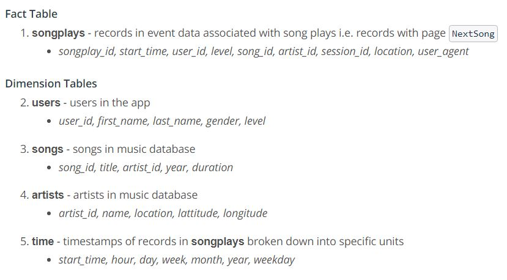
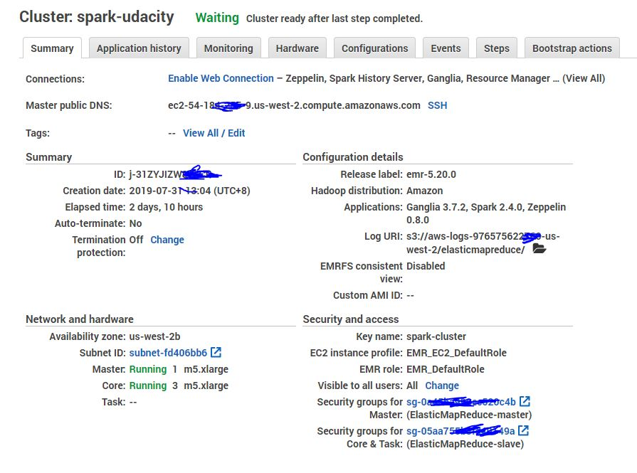

# Data Lake practise with Amazon Web Service (AWS)
- This is one of the projects of my Udacity Data Engineer NanoDegree Program

## Introduction
A music streaming startup, Sparkify, has grown their user base and song database and want to move their processes and data onto the cloud. Their data resides in S3 in a directory of JSON logs on user activity on the app as well as a directory with JSON metadata on the songs in their app.

As their data engineer, we are tasked with building an ETL pipeline that extracts their data from S3, processes them using Spark and loads the data back into S3 as a set of dimensional tables for their analytics team to continue finding insights in what songs their users are listening to. We'll be able to test your database and ETL pipeline by running queries given to you by the analytics team from Sparkify and compare your results with their expected results.

## Project Description
In this project, we'll make use AWS to build an ETL pipeline to load data from S3, process the data into analytics tables using Spark on EMR cluster then load them back into S3

## Dataset
The first dataset is a subset of real data from the Million Song Dataset. Each file is in JSON format and contains metadata about a song and the artist of that song. The files are partitioned by the first three letters of each song's track ID. For example, here are filepaths to two files in this dataset.
``` 
song_data/A/B/C/TRABCEI128F424C983.json
song_data/A/A/B/TRAABJL12903CDCF1A.json
```

The second dataset consists of log files in JSON format generated by event simulator based on the songs in the dataset above. These simulate activity logs from a music streaming app based on specified configurations.<br/>

The log files in the dataset you'll be working with are partitioned by year and month. For example, here are filepaths to two files in this dataset.<br/>
```
log_data/2018/11/2018-11-12-events.json
log_data/2018/11/2018-11-13-events.json
```
## Schema for Song Play Analysis
Using the song and event datasets, you'll need to create a star schema optimized for queries on song play analysis. This includes the following tables.<br/>


## Package required
```
import os
import datetime
import pyspark
import boto3
```
## Implementation steps
1. Use AWS to build an EMR Cluster <br/>

2. Edit the ```dl.cfg``` to complete the AWS credentials information
5. run the ```etl.py``` to load the data from S3, processes using Spark and loads the data back into S3

-------------------------------------------------------------------------------------------------------------------------------------
### More about me
[[:pencil:My Medium]](https://medium.com/@patrickhk)<br/>
[[:house_with_garden:My Website]](https://www.fiyeroleung.com/)<br/>
[[:space_invader:	My Github]](https://github.com/fiyero)<br/>
```
